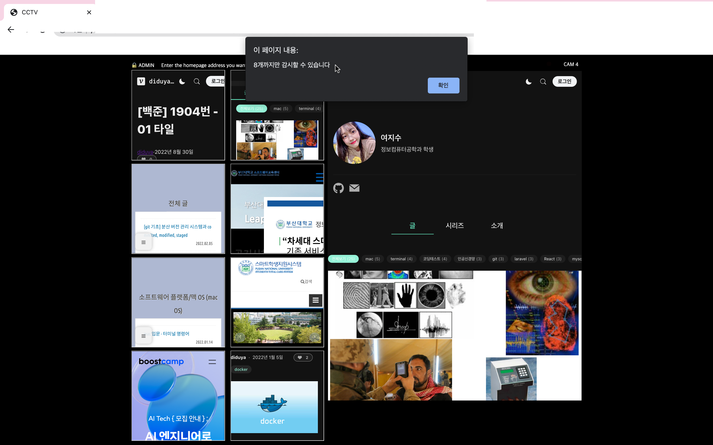

# :earth_americas: AdvancedWeb-study-blog

> ### 부산대학교 2학년 2학기 권혁철 교수님의 『웹응용프로그래밍』 강의의 실습 내용을 정리한 저장소입니다.
> 📌 html5.0, XML, CSS, JavaScript, PHP, JSON 과 같은 프로그래밍 언어를 배우고 웹페이지를 개발합니다. 

 

###### :bulb: HTML5 and Script Languages
###### :bulb: Cascading Style Sheets
###### :bulb: JavaScript
###### :bulb: Database: SQL, MSQL
###### :bulb: PHP & Server side programming
###### :bulb: XML
###### :bulb: Ajax

# 📁 1. CSS를 활용한 프로그램
### 📌 설명
CSS pagination을 이용하여 select를 구현한다.

flex-box와 object-fit를 이용하여 그림 하나를 16개로 나누어 분리하고, 그림 사이에는 box가 쳐지게 한다.
### 📌 결과 화면

  

# 📁 2. 홈페이지 모니터링 시스템
### 📌 설명
iframe(HTML5)과 flex, pagination을 이용하여 홈페이지 감시 시스템을 만든다.
- DOM의 명령어(예, setAttribite, event 등)을 활용한다.
- 사용자가 모니터링할 페이지를 입력하면, 그 사이트의 내용이 조그맣게 나온다.
- 등록하면 화면의 수는 늘어난다. (flex로 화면의 개수를 늘리기)
- 단, 늘일 수 있는 화면의 개수는 일단 8개로 제한한다.
- 그리고 화면의 반쯤에는 우리가 클릭한(또는 마우스오버한) 화면이 크게 나타난다.
### 📌 결과 화면

  

# 📁 3. DOM을 활용한 프로그램
- 특정한 URL을 넣으면 그 사이트 내용이 화면에 크게 보이고,
- 그 사이트에서 접근 가능한 페이지의 내용이 작게 모두 보이게 한다.
- 접근 가능한 페이지가 6개가 넘으면 scroll bar를 이용하여 볼 수 있게 한다.

# 📁 4. PHP로 데이터베이스(mysql) 접근
- 데이터베이스에 접근하여 간단한 테이블을 생성하고, 자료를 추가, 삭제, 변경을 한다.

# 📁 5. PHP로 데이터베이스 활용 
- 개인 정보를 PHP로 데이터베이스에 저장한다.
- $\_SERVER, S_ENV의 자료를 출력하여 내용을 분석한다.
- 특히 수행하는 파일의 위치가 어디인지 PATH를 찾는다.

# 📁 6. JSON 자료 활용
- JSON을 이용하여 서버에 자료를 보내고, 이를 다시 클라이언트에 저장한다.
- JSON을 이용하여 web storage에 자료를 저장하고 찾는다.
- cookie를 이용하여 자료를 저장하고 찾는다.

# 📁 7. XML 처리
- 데이터베이스에 저장한 자료에 대한 DTD를 작성한다.
- 이를 바탕으로 지금까지 사용한 자료를 XML로 표현한다.
- 표현한 내용을 그림 15-24(수업 시간에 설명한 프로그램) 프로그램에 loading하여 navigation하는 과정을 보인다.
# 📁 8. Ajax 활용
- 특별한 사진과 설명을 추가하여 사진 내용 설명이 가능하게 바꾸어본다.